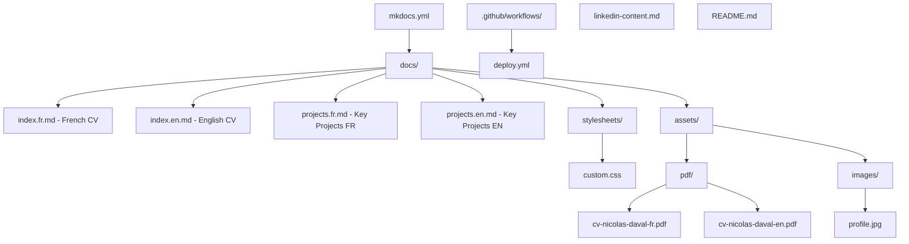

# Design Document: Modern CV MkDocs

## Overview

This design describes a bilingual (French/English) CV website for Nicolas DAVAL, built with MkDocs and the Material theme. The site showcases 22+ years of experience as a Data Architect & Tech Lead, targeting Data Architect / Cloud + Data + Software Solution Architect positions.

The architecture uses:
- **MkDocs** as the static site generator
- **Material for MkDocs** theme for modern UI and responsive design
- **mkdocs-static-i18n** plugin for bilingual content management with file-based translations
- **Material's built-in language selector** (`extra.alternate`) for the language toggle in the header
- **Custom CSS** for distinctive visual components (timeline, skill bars, cards)
- **GitHub Actions** for automated deployment to GitHub Pages

### Key Design Decisions

| Decision | Choice | Rationale |
|----------|--------|-----------|
| i18n approach | `mkdocs-static-i18n` plugin + Material `alternate` | Single project with file-suffix convention (`index.fr.md`, `index.en.md`). Material's native language selector provides the toggle button in the header. |
| File organization | Suffix-based (`*.fr.md`, `*.en.md`) | Simpler than subfolder approach; plugin handles URL routing automatically |
| CSS architecture | Single custom stylesheet with CSS variables | Maintainable, theme-consistent, easy to adjust palette |
| PDF approach | Pre-generated PDFs stored in `docs/assets/pdf/` | No build-time PDF generation needed; PDFs created externally and committed |
| Deployment | `mkdocs gh-deploy` via GitHub Actions | Official MkDocs approach, pushes to `gh-pages` branch |
| Color palette | Deep blue primary + teal accent | Professional, distinctive without being flashy; good contrast ratios |

## Architecture

### Site Structure Diagram



### File Organization

```
project-root/
├── mkdocs.yml                          # Main configuration
├── README.md                           # Setup and deployment instructions
├── linkedin-content.md                 # LinkedIn-ready content (English)
├── requirements.txt                    # Python dependencies
├── .github/
│   └── workflows/
│       └── deploy.yml                  # GitHub Actions workflow
└── docs/
    ├── index.fr.md                     # French CV (default landing page)
    ├── index.en.md                     # English CV
    ├── projects.fr.md                  # Key Projects (French)
    ├── projects.en.md                  # Key Projects (English)
    ├── stylesheets/
    │   └── custom.css                  # All custom components
    └── assets/
        ├── pdf/
        │   ├── cv-nicolas-daval-fr.pdf # French PDF
        │   └── cv-nicolas-daval-en.pdf # English PDF
        └── images/
            └── profile.jpg             # Profile photo (optional)
```

## Components and Interfaces

### MkDocs Configuration (`mkdocs.yml`)

The configuration ties together theme settings, plugins, navigation, and custom assets.

```yaml
site_name: Nicolas DAVAL - Data Architect & Tech Lead
site_url: https://nicodaval.github.io/
site_description: "CV - Nicolas DAVAL - Data Architect & Tech Lead - 22+ ans d'expérience"
site_author: Nicolas DAVAL

theme:
  name: material
  language: fr
  palette:
    - scheme: default
      primary: indigo
      accent: teal
  font:
    text: Inter
    code: JetBrains Mono
  features:
    - navigation.instant
    - navigation.tabs
    - content.tooltips
  icon:
    logo: material/account-tie

plugins:
  - search
  - i18n:
      default_language: fr
      languages:
        fr:
          name: Français
          build: true
        en:
          name: English
          build: true

extra:
  alternate:
    - name: Français
      link: /
      lang: fr
    - name: English
      link: /en/
      lang: en

extra_css:
  - stylesheets/custom.css

nav:
  - CV: index.md
  - Projets Clés: projects.md
```

### Plugin: mkdocs-static-i18n

The `mkdocs-static-i18n` plugin uses file suffixes to manage translations:
- `index.fr.md` → served at `/` (default language)
- `index.en.md` → served at `/en/`
- `projects.fr.md` → served at `/projets-cles/`
- `projects.en.md` → served at `/en/key-projects/`

The plugin automatically populates Material's `extra.alternate` configuration, enabling the native language selector toggle in the header bar.

### Custom CSS Components

#### Component: Timeline

The timeline displays career history with visual markers and connecting lines.

```
┌─────────────────────────────────────────────┐
│  ● 2021 - Present                           │
│  │  Data Architect                          │
│  │  Stellantis Financial Services           │
│  │  Description text...                     │
│  │                                          │
│  ● 2017 - 2021                              │
│  │  Software Architect                      │
│  │  PSA Finance (now Stellantis FS)         │
│  │  Description text...                     │
│  │                                          │
│  ● 2012 - 2017                              │
│  │  Java Tech Lead                          │
│  │  ...                                     │
└─────────────────────────────────────────────┘
```

HTML structure (in Markdown):
```html
<div class="timeline">
  <div class="timeline-item">
    <div class="timeline-marker"></div>
    <div class="timeline-date">2021 - Présent</div>
    <div class="timeline-content">
      <h3>Data Architect</h3>
      <p class="timeline-company">Stellantis Financial Services</p>
      <p>Description...</p>
    </div>
  </div>
  <!-- more items -->
</div>
```

#### Component: Skill Bars

Horizontal bars showing proficiency levels by category.

```
┌─────────────────────────────────────────────┐
│  Data & Cloud                               │
│  Snowflake      ████████████████████░░  90% │
│  dbt            ████████████████████░░  90% │
│  Airflow        ████████████████░░░░░░  80% │
│  AWS            ████████████████░░░░░░  80% │
│                                             │
│  Development                                │
│  Python         ████████████████████░░  90% │
│  Java/Spring    ████████████████░░░░░░  80% │
│  SQL            ████████████████████░░  90% │
└─────────────────────────────────────────────┘
```

HTML structure:
```html
<div class="skills-section">
  <h3>Data & Cloud</h3>
  <div class="skill-bar">
    <div class="skill-label">Snowflake</div>
    <div class="skill-track">
      <div class="skill-fill" style="width: 90%"></div>
    </div>
    <div class="skill-percent">90%</div>
  </div>
  <!-- more skills -->
</div>
```

#### Component: Cards

Used for education, certifications, and key projects.

```
┌─────────────────────────────────────────────┐
│  ┌──────────────────┐  ┌──────────────────┐ │
│  │ 🎓 Formation     │  │ 📜 Certification │ │
│  │                  │  │                  │ │
│  │ DUT Informatique │  │ AWS Solutions    │ │
│  │ IUT de Metz      │  │ Architect        │ │
│  │ 2000 - 2002      │  │ 2023             │ │
│  └──────────────────┘  └──────────────────┘ │
└─────────────────────────────────────────────┘
```

HTML structure:
```html
<div class="card-grid">
  <div class="card">
    <div class="card-icon">🎓</div>
    <h3>DUT Informatique</h3>
    <p class="card-subtitle">IUT de Metz</p>
    <p class="card-date">2000 - 2002</p>
  </div>
  <!-- more cards -->
</div>
```

#### Component: PDF Download Button

A prominent button placed at the top of each CV page.

```html
<a href="/assets/pdf/cv-nicolas-daval-fr.pdf" class="pdf-download-btn" download>
  📄 Télécharger le CV en PDF
</a>
```

### Page Structure (CV Pages)

Each CV page follows this section order:

1. **Header** — Name, title, location, contact links, PDF download button
2. **Profile Summary** — 3-4 sentence professional summary
3. **Key Skills** — Skill bars grouped by category
4. **Career History** — Timeline component (reverse chronological)
5. **Key Projects** (brief highlights, link to full page)
6. **Education & Certifications** — Card grid
7. **Soft Skills & Interests** — Simple list/tags

### Page Structure (Key Projects)

1. **Introduction** — Brief context
2. **Project Cards** — 3-5 cards, each with:
   - Project title
   - Context/company
   - Technologies used (as tags)
   - Key outcomes/metrics

## Data Models

### Content Model

The site content is entirely static Markdown with embedded HTML for custom components. No database or dynamic data source is involved.

| Content Type | Format | Location |
|-------------|--------|----------|
| CV content (FR) | Markdown + HTML | `docs/index.fr.md` |
| CV content (EN) | Markdown + HTML | `docs/index.en.md` |
| Projects (FR) | Markdown + HTML | `docs/projects.fr.md` |
| Projects (EN) | Markdown + HTML | `docs/projects.en.md` |
| PDF files | Binary PDF | `docs/assets/pdf/` |
| LinkedIn content | Markdown | `linkedin-content.md` (root) |
| Custom styles | CSS | `docs/stylesheets/custom.css` |

### Configuration Model

```yaml
# mkdocs.yml structure
site_name: string
site_url: string
site_description: string
site_author: string
theme:
  name: "material"
  language: "fr" | "en"
  palette: { scheme, primary, accent }
  font: { text, code }
  features: string[]
plugins:
  - search
  - i18n: { default_language, languages }
extra:
  alternate: { name, link, lang }[]
extra_css: string[]
nav: { label: path }[]
```

## Error Handling

Since this is a static site with no server-side logic, error handling is minimal:

| Scenario | Handling |
|----------|----------|
| 404 page not found | Material theme provides a default 404 page; can be customized via `docs/404.md` |
| Missing PDF file | Download button links to a committed file; if missing, standard 404 |
| Build failure in CI | GitHub Actions workflow fails; no deployment occurs; previous version remains live |
| Invalid YAML config | `mkdocs build --strict` catches errors during CI; build fails before deploy |
| Missing translation file | `mkdocs-static-i18n` falls back to default language content |

## Testing Strategy

### Why Property-Based Testing Does Not Apply

This feature is a static site built with MkDocs (a documentation framework). It involves:
- YAML configuration
- CSS styling and visual components
- Markdown content authoring
- CI/CD pipeline (GitHub Actions)
- Static file organization

There are no pure functions, parsers, serializers, or algorithmic logic to validate with property-based testing. The "code" is declarative configuration and styling, not executable logic with input/output behavior.

### Recommended Testing Approach

| Test Type | What It Validates | Tool |
|-----------|-------------------|------|
| **Build validation** | Site builds without errors | `mkdocs build --strict` |
| **Link checking** | No broken internal/external links | `mkdocs build --strict` or `htmlproofer` |
| **HTML validation** | Valid HTML output | W3C validator or `html5validator` |
| **Visual regression** | CSS components render correctly | Manual review or Percy/Playwright screenshots |
| **Responsive check** | Layout works on mobile/tablet/desktop | Browser DevTools, manual testing |
| **i18n verification** | Both languages build and language switcher works | Manual testing + build validation |
| **CI/CD smoke test** | Deployment workflow succeeds | GitHub Actions run status |
| **PDF availability** | Download links resolve correctly | Manual check after deploy |

### CI/CD Testing (in GitHub Actions)

The deployment workflow includes a build step with `--strict` mode that validates:
- All internal links resolve
- No warnings from plugins
- YAML configuration is valid
- All referenced files exist

```yaml
# In deploy.yml
- run: mkdocs build --strict  # Fails on warnings
```

### Manual Testing Checklist

- [ ] French CV page loads as default
- [ ] English CV page accessible via language switcher
- [ ] Language switcher toggles correctly and stays on equivalent page
- [ ] Timeline renders with markers and connecting lines
- [ ] Skill bars display with correct widths
- [ ] Cards display in grid on desktop, single column on mobile
- [ ] PDF download buttons work for both languages
- [ ] Key Projects page accessible from navigation
- [ ] Site is responsive at 320px, 768px, and 1200px+ widths
- [ ] Open Graph meta tags present in HTML source

## CSS Architecture

### Design Tokens (CSS Custom Properties)

```css
:root {
  /* Primary palette */
  --cv-primary: #1a237e;          /* Deep indigo - headings, timeline markers */
  --cv-primary-light: #3949ab;    /* Lighter indigo - hover states */
  --cv-accent: #00897b;           /* Teal - accent elements, skill bars */
  --cv-accent-light: #4db6ac;     /* Light teal - secondary accents */
  
  /* Neutrals */
  --cv-bg: #fafafa;               /* Page background */
  --cv-surface: #ffffff;          /* Card backgrounds */
  --cv-text: #212121;             /* Body text */
  --cv-text-secondary: #616161;   /* Secondary text */
  --cv-border: #e0e0e0;           /* Borders and dividers */
  
  /* Shadows */
  --cv-shadow-sm: 0 2px 4px rgba(0,0,0,0.08);
  --cv-shadow-md: 0 4px 12px rgba(0,0,0,0.12);
  
  /* Spacing */
  --cv-spacing-xs: 0.25rem;
  --cv-spacing-sm: 0.5rem;
  --cv-spacing-md: 1rem;
  --cv-spacing-lg: 1.5rem;
  --cv-spacing-xl: 2rem;
  
  /* Border radius */
  --cv-radius: 8px;
  --cv-radius-sm: 4px;
  
  /* Timeline */
  --cv-timeline-line: 2px;
  --cv-timeline-marker: 14px;
}
```

### Typography

- **Headings**: Inter (600/700 weight) — clean, modern sans-serif
- **Body**: Inter (400 weight) — excellent readability
- **Code/Tech tags**: JetBrains Mono — distinguishes technical terms

Hierarchy:
- H1: 2rem, 700 weight, primary color
- H2: 1.5rem, 600 weight, primary color
- H3: 1.25rem, 600 weight, text color
- Body: 1rem, 400 weight, text color
- Caption/dates: 0.875rem, 400 weight, secondary text color

### Responsive Breakpoints

| Breakpoint | Target | Layout Changes |
|-----------|--------|----------------|
| < 768px | Mobile | Single column, stacked timeline, full-width cards |
| 768px - 1024px | Tablet | 2-column card grid, timeline with reduced spacing |
| > 1024px | Desktop | Full layout, 2-3 column card grid, spacious timeline |

## GitHub Actions Workflow Design

```yaml
name: Deploy CV Site

on:
  push:
    branches:
      - main

permissions:
  contents: write

jobs:
  deploy:
    runs-on: ubuntu-latest
    steps:
      - uses: actions/checkout@v4

      - uses: actions/setup-python@v5
        with:
          python-version: '3.12'

      - name: Cache pip dependencies
        uses: actions/cache@v4
        with:
          path: ~/.cache/pip
          key: ${{ runner.os }}-pip-${{ hashFiles('requirements.txt') }}

      - name: Install dependencies
        run: pip install -r requirements.txt

      - name: Build site (strict mode)
        run: mkdocs build --strict

      - name: Deploy to GitHub Pages
        run: mkdocs gh-deploy --force
```

### Dependencies (`requirements.txt`)

```
mkdocs>=1.6.0
mkdocs-material>=9.5.0
mkdocs-static-i18n>=1.2.0
```

## PDF Generation Approach

PDFs are **pre-generated externally** and committed to the repository. This avoids complex build-time PDF generation dependencies.

### Workflow

1. Author creates/updates CV content in Markdown
2. Author generates PDF using one of:
   - **Option A**: Export from a word processor (Google Docs, LibreOffice) with matching styling
   - **Option B**: Use a Markdown-to-PDF tool locally (e.g., `pandoc` with a LaTeX template, or `weasyprint`)
   - **Option C**: Print-to-PDF from the deployed site (browser print dialog)
3. PDFs are committed to `docs/assets/pdf/`
4. Site deployment includes PDFs as static assets

### PDF Naming Convention

- `cv-nicolas-daval-fr.pdf` — French version
- `cv-nicolas-daval-en.pdf` — English version

### Download Button Placement

Each CV page includes a download button in the header section, styled as a prominent call-to-action:

```html
<a href="../assets/pdf/cv-nicolas-daval-fr.pdf" class="pdf-download-btn" download>
  📄 Télécharger le CV en PDF
</a>
```

## SEO and Metadata

### Open Graph Tags

Material for MkDocs supports social cards and meta tags via configuration:

```yaml
# In mkdocs.yml
extra:
  social:
    - icon: fontawesome/brands/linkedin
      link: https://linkedin.com/in/nicolasdaval
    - icon: fontawesome/brands/github
      link: https://github.com/nicodaval
```

Additional meta tags are added per-page via Markdown front matter:

```yaml
---
title: Nicolas DAVAL - Data Architect & Tech Lead
description: CV de Nicolas DAVAL - Data Architect & Tech Lead - 22+ ans d'expérience
---
```

Material theme automatically generates Open Graph `og:title`, `og:description`, `og:url`, and `og:type` tags from the page metadata and site configuration.
